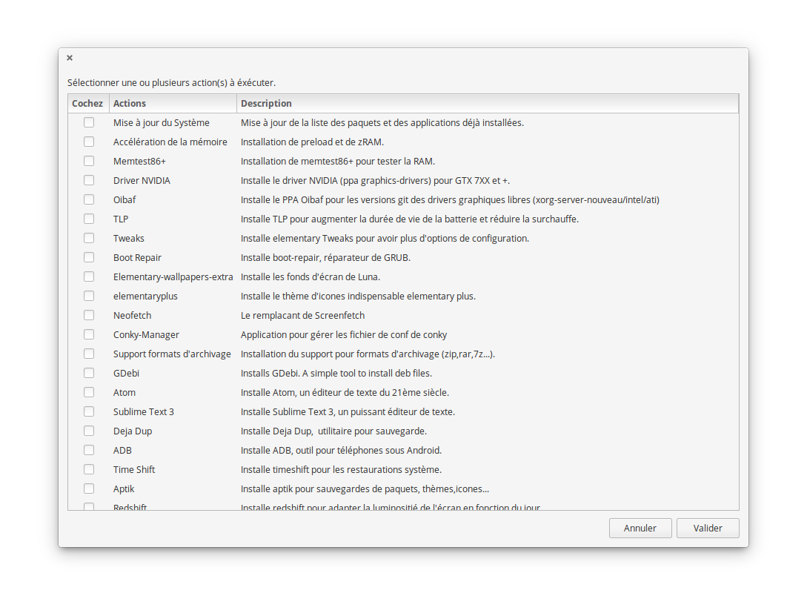

# Script Post Installation pour elementary OS 0.3 Freya et 0.4 Loki (beta)
# Sistema Post Script para OS elementar 0,3 0,4 Freya e Loki (beta)

Ce script a pour but de rendre facile l'installation d'applications tierces juste après une installation
d'elementary OS 0.4 Loki.
Este script é projetado para tornar mais fácil de instalar aplicativos de terceiros apenas após a instalação
de OS elementar 0,4 Loki.



## Utilisação

Pré-requisitos

```bash
sudo apt -y install software-properties-common python-software-properties
```

Copie essa linha para um terminal

```bash
wget -O /tmp/elementary_loki-postinstall.sh https://raw.githubusercontent.com/Devil505/elementaryos-postinstall/master/elementary_loki-postinstall.sh && chmod +x /tmp/elementary_loki-postinstall.sh && /tmp/elementary_loki-postinstall.sh
```

## Fonte
Script em grande parte inspirado por esta:
https://github.com/ylrxeidx/elementary-script
